.png)

## 🖐️ About Me
I'm a Software Developer at SAPHI Engineering with a passion for coding, electronics, and solving real-world problems through software.  

I'm currently pursuing a **Bachelor of Software Engineering** at my local university while working on:  
- **Augmentative and Alternative Communication (AAC) apps & devices**  
- **A social media app for university students**  
- **A developer tool to automate repetitive tasks**  

I love learning, building cool projects, and making technology more accessible and efficient.

## 🚀 Projects

  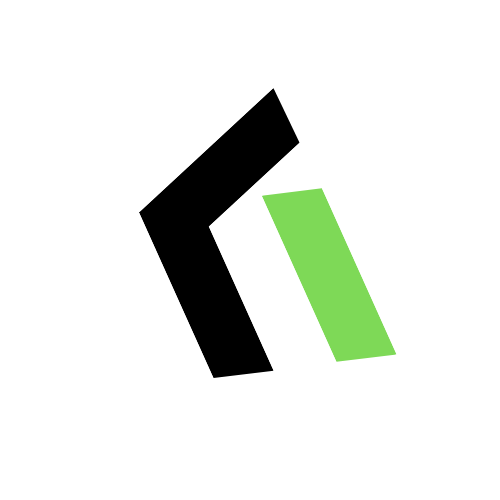
  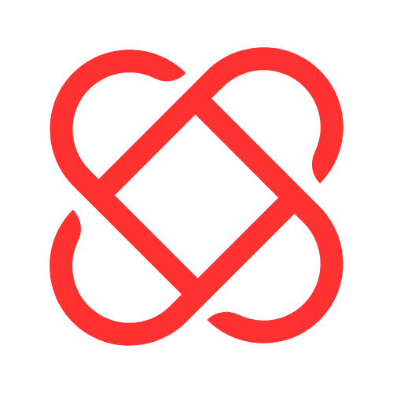
  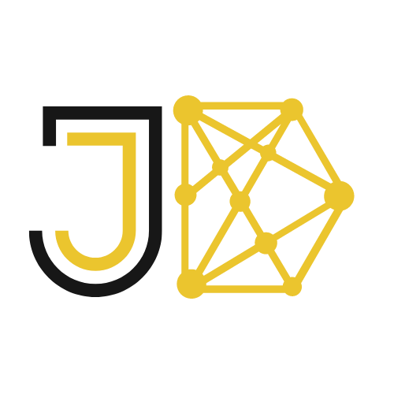
  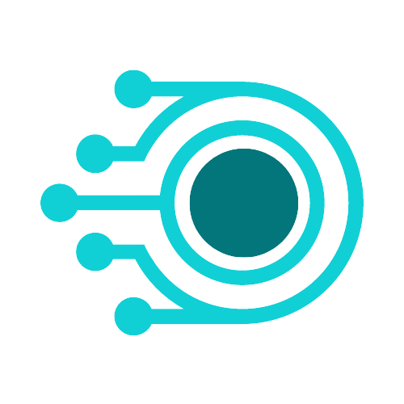
  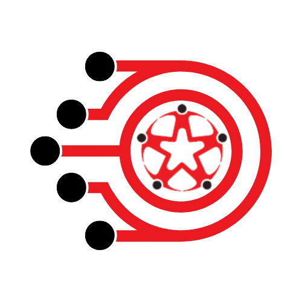

## 📒 Skills & Tech Stack

  
  
  
  
  
  
  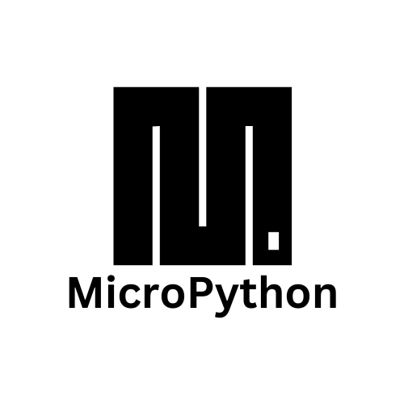
  
  
  
  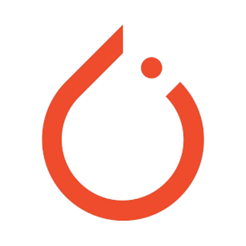
  
  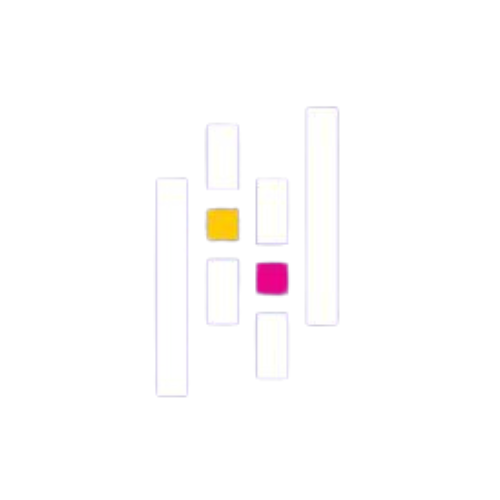
  
  
  
  
  
  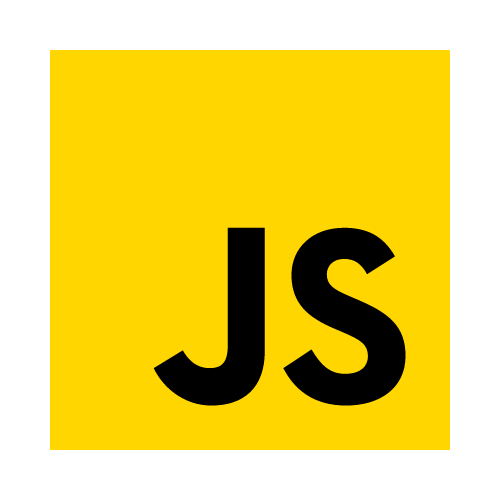
  
  
  
  
  
  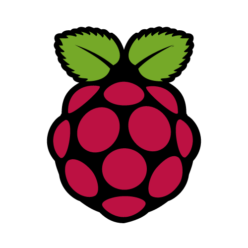
  
  
  
  
  
  
  
  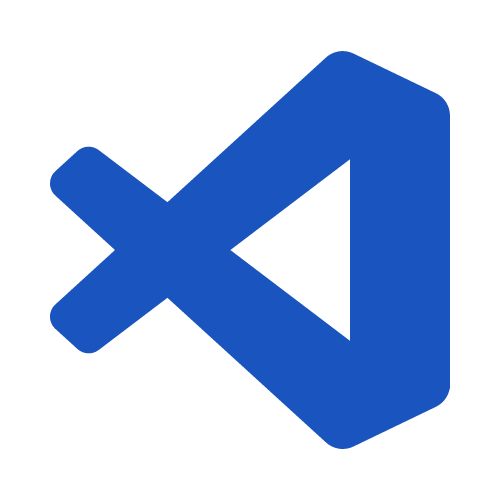
  
  
  
  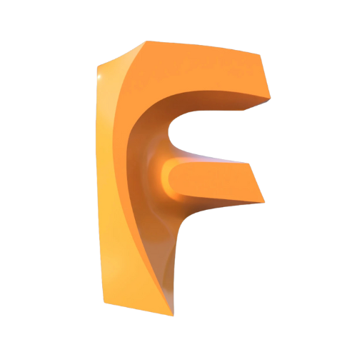
  
  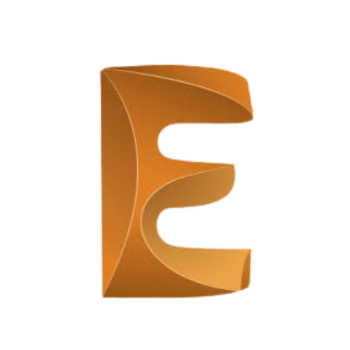

## 📬 Get in Touch  
If you have any feedback, want to collaborate, or just want to chat, feel free to reach out!  
📧 **Email:** [Squidly1408@gmail.com](mailto:Squidly1408@gmail.com)

