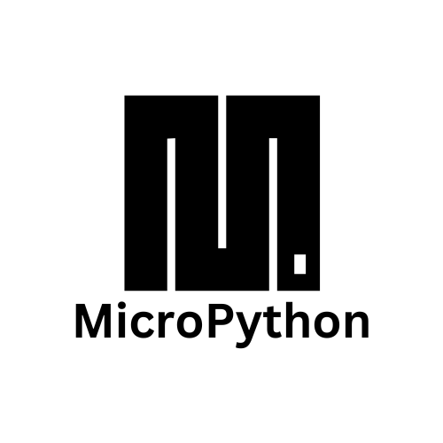
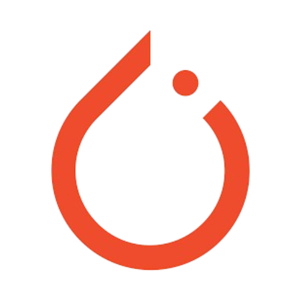
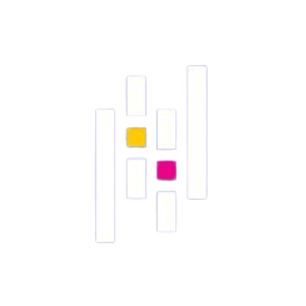
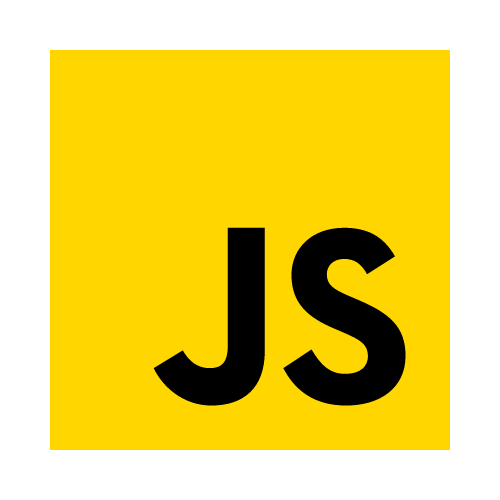
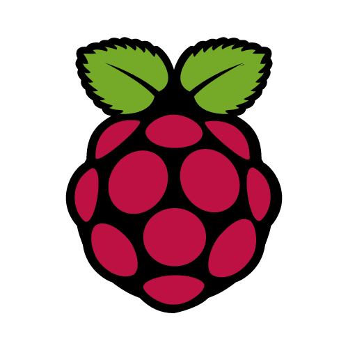
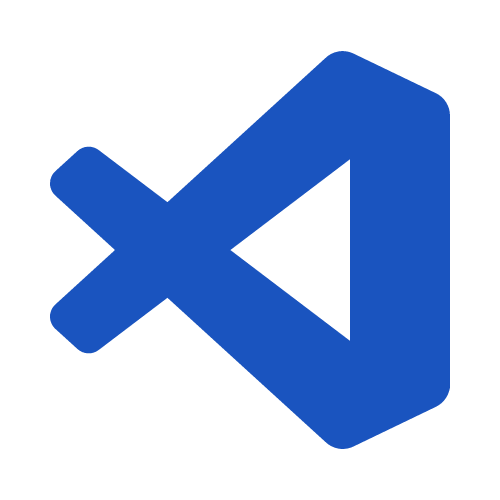
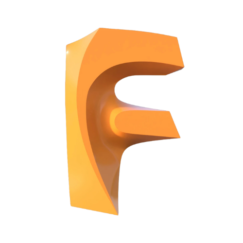

.png>)

## 🦑 About Me

Software Engineer | AI Developer | University Research Lead

I’m a Software Engineering student at the University of Newcastle, Australia, and a Software Engineer with experience in full-stack development, AI systems, computer vision, Flutter applications, and research-focused software projects.

I enjoy building scalable systems, creating polished user experiences, and developing technology that solves real-world problems. My work ranges from AI-powered computer vision systems and embedded hardware projects to large-scale educational web platforms and portfolio systems.

## 🚀 Projects

    <h1>Big Picture Education Australia Portfolio Creator Platform</h1>
    <h1>Big Picture Education Australia IBPLC Flower Graph</h1>
    <h1>Luvium – Project Collaboration / Research Social Platform</h1>
    <h1>Internship Location Web App</h1>
    <h1>NuConSoft App</h1>
    <h1>Family Health History App</h1>
    <h1>AI Voice Assistant with Custom Commands</h1>
    <h1>YOLOv7 Vehicle Detection and Counting System</h1>
    <h1>YOLOv7 Number Detection System</h1>
    <h1>YOLOv8 Auto Annotator for Images and Videos</h1>
    <h1>Flutter Development Workflow GUI Tool</h1>
    <h1>Jira Ticket Dashboard / Testing Workflow Tool</h1>
    <h1>Portfolio Website</h1>
    <h1>Designer Portfolio Section Library</h1>
    <h1>Network IP Logger / Scanner</h1>
  

## 📒 Skills

  
  
  
  
  
  
  
  
  
  
  
  
  
  
  
  
  
  
  
  
  
  
  
  
  
  
  
  
  
  
  
  
  
  
  
  
  
  
  

\
\
\
If you have any feedback or just want to reach out, please reach out to me at Squidly1408@Gmail.com
