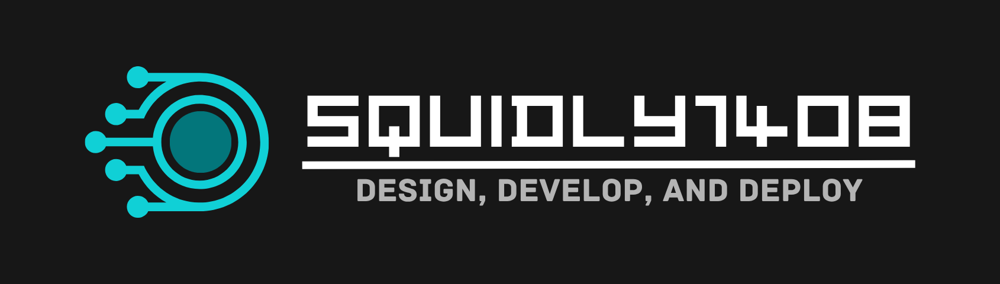

# Squidly1408 🦑

**Software Engineering (Honours) Student @ University of Newcastle // Software Developer with Industry Experience**

I’m a Software Engineering student at the University of Newcastle, Australia, and a Software Engineer with experience in full-stack development, AI systems, computer vision, Flutter applications, and research-focused software projects.

I enjoy building scalable systems, creating polished user experiences, and developing technology that solves real-world problems. My work ranges from AI-powered computer vision systems and embedded hardware projects to large-scale educational web platforms and portfolio systems.

If you have any feedback or just want to reach out, please reach out to me at Squidly1408@Gmail.com

## Projects 🚀

[**UConSoft**](https://github.com/Squidly1408/UConSoft) - A university-focused software platform designed to support student collaboration, project management, and scalable educational tooling with a modern full-stack architecture.

[**Luvium**](https://github.com/Squidly1408/fic) - A collaborative social and research platform focused on connecting students, supporting project collaboration, and creating a shared environment for innovation and communication. - [**[LIVE LINK]**](https://luvium-chc.github.io/)

[**BPL Flower**](https://github.com/Squidly1408/BPL-Flower) - An interactive IBPLC flower graph system for Big Picture Education Australia featuring live editing, SVG exporting, embedded modes, and customizable visual themes. - [**[LIVE LINK]**](https://www.bigpicture.org.au/what-international-big-picture-learning-credential)

[**BPLIO**](https://github.com/Squidly1408/bplio) - BPLIO is a modern portfolio and student showcase platform built for Big Picture Education Australia, designed to help students create professional, IBPLC-aligned digital portfolios with an intuitive and designer-focused experience. - [**[LIVE LINK]**](https://bplio-learning.web.app/)

[**Red Car Counter**](https://github.com/Squidly1408/Red_car_counter) - An AI-powered computer vision system using YOLO-based detection to identify, track, and count vehicles in real time with analytics and automated logging.

[**AltComms**](https://github.com/Squidly1408/AltComms) - Free, open-source, offline-first AAC communication app built with Flutter. Symbol boards, keyboard & switch-scanning modes, feelings/healthcare/schedules, caregiver dashboard, fully on-device, no subscription.

[**Flutter CLI**](https://github.com/Squidly1408/Flutter_CLI) - A developer workflow automation toolkit for Flutter projects that streamlines builds, localization generation, testing, cleaning, and deployment processes.

[**SQDLC-CAD**](https://github.com/Squidly1408/SQDLC-CAD) - A free, browser-based 3D modeling / CAD tool. No sign-up, no account, no server — everything runs and is stored entirely on your machine, in your browser. - [**[LIVE LINK]**](https://squidly1408.github.io/apps/SQDLC-CAD/)

[**Furni4**](https://github.com/Squidly1408/furni4) - Draw a room or building to scale, furnish it with accurately-sized objects, and preview the result in 3D. Built with Next.js (App Router), TypeScript, Tailwind CSS, Zustand, Konva (2D canvas), and React Three Fiber (3D preview). - [**[LIVE LINK]**](https://squidly1408.github.io/apps/Furni4/)

[**Traceboard**](https://github.com/Squidly1408/Traceboard) - A browser-based image-to-SVG tracing application built with native web technologies. Traceboard provides precision Bézier curve editing, freehand drawing, automatic image tracing, and clean SVG export, all without a backend, frameworks, or build tools. - [**[LIVE LINK]**](https://squidly1408.github.io/apps/TraceBoard/)

[**Bindary**](https://github.com/Squidly1408/Bindary) - Turn completed tasks into short poems, saved to a private Firebase-backed library. React + Vite. - [**[LIVE LINK]**](https://bindary-books.web.app/)

[**Squids-GiftList**](https://github.com/Squidly1408/squids-giftlist) - Gift-list web app, create lists for any occasion, share a link, and let people claim gifts without spoiling the surprise. React + TypeScript + Firebase. - [**[LIVE LINK]**](https://squids-giftlist.web.app/)

[**PHOTOLIO**](https://github.com/Squidly1408/Photolio) - A light-table style builder for photography portfolios. Preview the finished one-page site at desktop, tablet, or mobile width. Sign in to save your work to the cloud and publish it at a public URL — /portfolio/your-username. - [**[LIVE LINK]**](https://photolio-portfolio.web.app/)

[**BPL-Slides**](https://github.com/Squidly1408/bpl-slides) - A fully client-side, offline-capable slideshow builder for Big Picture Learning students. Covers thing like Gateway projects, Senior Projects, typical projects, and blank slides, has the capability for math, CAD files, Images, videos, embedded websites, etc, etc. - [**[LIVE LINK]**](https://bpl-slides.web.app/)

## Skills ⚒️

Java, Dart, Flutter, HTML, CSS, Javascript, XML, PHP, Python, MicroPython, Github, Git, RaspberryPi, Adafruit, Arduino, Visual Studio COde, Visual Studio, Fusion 360, Autodesk Eagle, YoloV7, YoloV8
